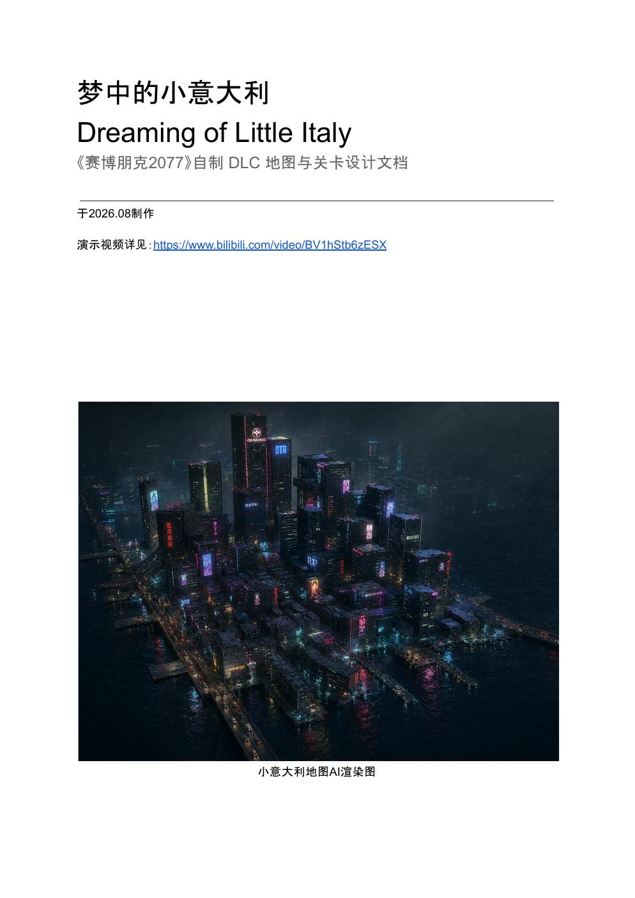

# 梦中的小意大利

## Dreaming of Little Italy

基于《赛博朋克2077》世界观创作的自制 DLC 地图与关卡设计项目。项目在夜之城 Downtown 西侧滨水区域重新设计一片具有独立历史与社区文化的 Little Italy，并将一条完整任务关卡嵌入城市空间，通过 UE5.8 白盒与玩法原型验证玩家路线、任务节奏和关键 Gameplay 节点。

## 项目概览

- 制作时间：2026年8月
- 项目类型：开放世界地图设计 / 任务与关卡设计 / UE5原型验证
- 设计范围：约 750 m × 500 m 滨水城区
- 完整文档：38页

## 核心设计内容

- 基于原作 Downtown 城市结构的地图改造与地区身份塑造
- 城市功能分区、空间层级、地标与主要 POI 安排
- 车辆移动、步行探索和任务路线之间的尺度转换
- 六阶段任务流程与“好奇 - 亲近 - 紧张 - 认可 - 兴奋 - 怀疑”的情绪曲线
- 城市空间、Gameplay与叙事信息的协同推进
- UE5.8 白盒、任务流程原型、关键玩法验证及迭代记录
- 面向团队制作的关卡、美术、程序与交互需求拆解

## 完整文档与演示

- [查看 / 下载高清 PDF](docs/dreaming-of-little-italy-design-document.pdf)
- [观看 Bilibili 演示视频 BV1hStb6zESX](https://www.bilibili.com/video/BV1hStb6zESX)

## 说明

本项目为个人非商业创作及作品集展示用途，与 CD PROJEKT RED 无关联。《赛博朋克2077》及相关名称、画面与知识产权归其原权利方所有。
